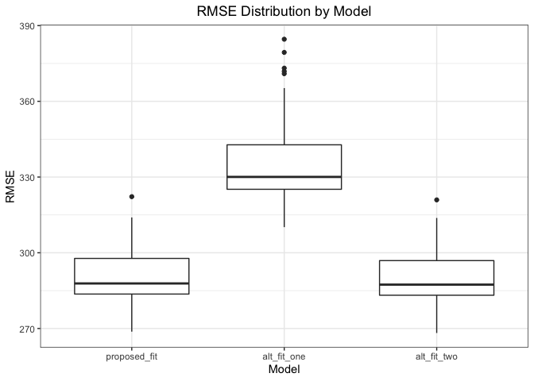

p8105\_hw6\_bpg2118
================
Benjamin Goebel
12/3/2021

## Problem 1

Let’s begin by reading in the data.

``` r
birthweight <- read_csv(here("data", "birthweight.csv"))
```

Let’s check for missing.

``` r
# Purpose: Count number of missing values in a vector
# Arguments: vct: A vector
# Returns: An integer, the number of missing values
num_missing <- function(vct) {
  return(sum(is.na(vct)))
}

# Map num_missing on all columns in the birthweight dataframe
birthweight %>%
  map(num_missing) %>%
  as_tibble() %>%
  pivot_longer(babysex:wtgain,
               names_to = "variables",
               values_to = "n_missing") %>%
  knitr::kable()
```

| variables | n\_missing |
|:----------|-----------:|
| babysex   |          0 |
| bhead     |          0 |
| blength   |          0 |
| bwt       |          0 |
| delwt     |          0 |
| fincome   |          0 |
| frace     |          0 |
| gaweeks   |          0 |
| malform   |          0 |
| menarche  |          0 |
| mheight   |          0 |
| momage    |          0 |
| mrace     |          0 |
| parity    |          0 |
| pnumlbw   |          0 |
| pnumsga   |          0 |
| ppbmi     |          0 |
| ppwt      |          0 |
| smoken    |          0 |
| wtgain    |          0 |

No missing data-great!

Next, let’s convert columns to be factors where necessary.

``` r
# Recode variables from encoding to label and make factors
birthweight <- birthweight %>%
  mutate(
    babysex = recode(babysex, `1` = "male", `2` = "female"),
    babysex = factor(babysex),
    frace = recode(frace, `1` = "White", `2` = "Black", `3` = "Asian", 
                          `4` = "Puerto Rican", `8` = "Other", 
                          `9` = "Unknown"),
    frace = factor(frace),
    malform = recode(malform, `0` = "absent", `1` = "present"),
    malform = factor(malform),
    mrace = recode(mrace, `1` = "White", `2` = "Black", `3` = "Asian", 
                          `4` = "Puerto Rican", `8` = "Other"),
    mrace = factor(mrace)
  )
```

Now, let’s get the pearson correlation coefficient between each variable
and birth weight.

``` r
# Map over the columns in the dataframe and calculate pearson correlation
# coefficient between each column and the outcome baby birth weight
birthweight %>%
  map(~cor(as.numeric(.x), pull(birthweight, bwt), method = "pearson")) %>%
  as_tibble() %>%
  pivot_longer(babysex:wtgain,
               names_to = "variables",
               values_to = "r") %>%
  knitr::kable()
```

| variables |          r |
|:----------|-----------:|
| babysex   |  0.0866418 |
| bhead     |  0.7471068 |
| blength   |  0.7434508 |
| bwt       |  1.0000000 |
| delwt     |  0.2878893 |
| fincome   |  0.1545715 |
| frace     |  0.2857572 |
| gaweeks   |  0.4121833 |
| malform   |  0.0013332 |
| menarche  | -0.0244247 |
| mheight   |  0.1921632 |
| momage    |  0.1357734 |
| mrace     |  0.2911120 |
| parity    | -0.0083741 |
| pnumlbw   |         NA |
| pnumsga   |         NA |
| ppbmi     |  0.0939457 |
| ppwt      |  0.1828920 |
| smoken    | -0.0756278 |
| wtgain    |  0.2472526 |

Only two variables have a pearson correlation coefficient greater than
0.5. These variables are `bhead` and `blength`, the baby’s head
circumference at birth and the baby’s length at birth, respectively. We
can a fit a linear regression model with these two variables to predict
birth weight. For simplicity, we will not use an interaction term.

``` r
proposed_fit <- lm(bwt ~ bhead + blength, data = birthweight)
```

Let’s plot model residual as a function of model prediction.

``` r
# Get model predictions
# Get model residuals
# Plot line graph of model residual as a function of model prediction
birthweight %>%
  add_predictions(proposed_fit) %>%
  add_residuals(proposed_fit) %>%
  ggplot(aes(x = pred, y = resid)) +
  geom_line() +
  theme_bw() +
  theme(plot.title = element_text(hjust = 0.5)) +
  labs(
    title = "Model Residual as a function of Model Prediction",
    x = "Prediction",
    y = "Residual"
  )
```

<!-- -->

From the plot, we see the model mostly underestimates birth weight for
predicted values less than 2000 grams. For predicted birth weights
greater than 2000 grams, the residual tends to be evenly and randomly
split over and under zero.

Let’s get the cross-validated predicted error for our proposed model, as
well as, two other linear regression models: one with birth length and
gestational age without interaction term and one with head circumference
at birth, birth length, sex, and all interaction terms.

``` r
# Create 100 80-20 train-test splits
# Run each of the three models on each of the 100 training data sets
# Test each of the three models on each of the 100 testing data sets and
# calculate RMSE.
cv_df <- crossv_mc(birthweight, 100) %>%
  mutate(
    train = map(train, as_tibble),
    test = map(test, as_tibble)
  ) %>%
  mutate(
    proposed_fit = map(train, ~lm(bwt ~ bhead + blength, data = .x)),
    alt_fit_one = map(train, ~lm(bwt ~ blength + gaweeks, data = .x)),
    alt_fit_two = map(train, ~lm(bwt ~ bhead*blength*babysex, data = .x))
  ) %>%
  mutate(
    rmse_proposed_fit = map2_dbl(proposed_fit, test, ~rmse(model = .x, data = .y)),
    rmse_alt_fit_one = map2_dbl(alt_fit_one, test, ~rmse(model = .x, data = .y)),
    rmse_alt_fit_two = map2_dbl(alt_fit_two, test, ~rmse(model = .x, data = .y))
  )
```

Let’s compare the root mean squared error of the three models with a
boxplot.

``` r
# Create boxplot to visualize the distribution of RMSE for the 100 testing
# data sets for each of the models
cv_df %>%
  select(starts_with("rmse")) %>%
  pivot_longer(everything(),
               names_to = "model",
               values_to = "rmse",
               names_prefix = "rmse_") %>%
  mutate(model = fct_inorder(model)) %>%
  ggplot(aes(x = model, y = rmse)) +
  geom_boxplot() +
  theme_bw() +
  labs(
    x = "Model",
    y = "RMSE",
    title = "RMSE Distribution by Model"
  ) +
  theme(plot.title = element_text(hjust = 0.5))
```

<!-- -->

The proposed model and the alternate model with predictors head
circumference, birth length, sex, and all interaction terms have similar
root mean squared error. The other alternate model with predictors birth
length and gestational age without interaction term has the highest root
mean squared error of the three models.
